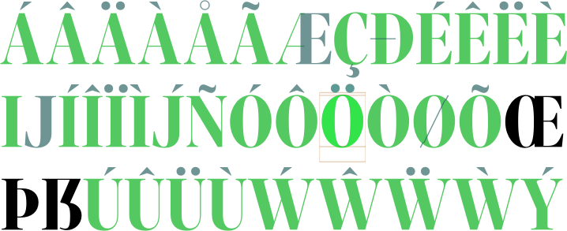

# ShowComponentOrder.glyphsReporter

This is a plugin for the [Glyphs font editor](http://glyphsapp.com/).

*View > Show Component Order* (de: *Reihenfolge der Komponenten anzeigen,* fr: *Afficher ordre des composants,* es: *Mostrar orden de componentes,* nl: *Toon volgorde van componenten*) displays components in different colors depending on the order of the component. This way, you can quickly spot an order mistake.

You can set a keyboard shortcut in System Preferences.

### Installation

1. In *Window > Plugin Manager,* click on the *Install* button next to *Show Component Order.*
2. Restart Glyphs.

### Usage Instructions

1. Open a glyph in Edit View.
2. Use *View > Show Component Order* to toggle the Component Order View.

### Requirements

The plugin needs Glyphs 2.4 or higher.

### License

Copyright 2014+2018 Rainer Erich Scheichelbauer (@mekkablue).
Based on sample code by Georg Seifert (@schriftgestalt) and Jan Gerner (@yanone).

Licensed under the Apache License, Version 2.0 (the "License");
you may not use this file except in compliance with the License.
You may obtain a copy of the License at

http://www.apache.org/licenses/LICENSE-2.0

See the License file included in this repository for further details.
